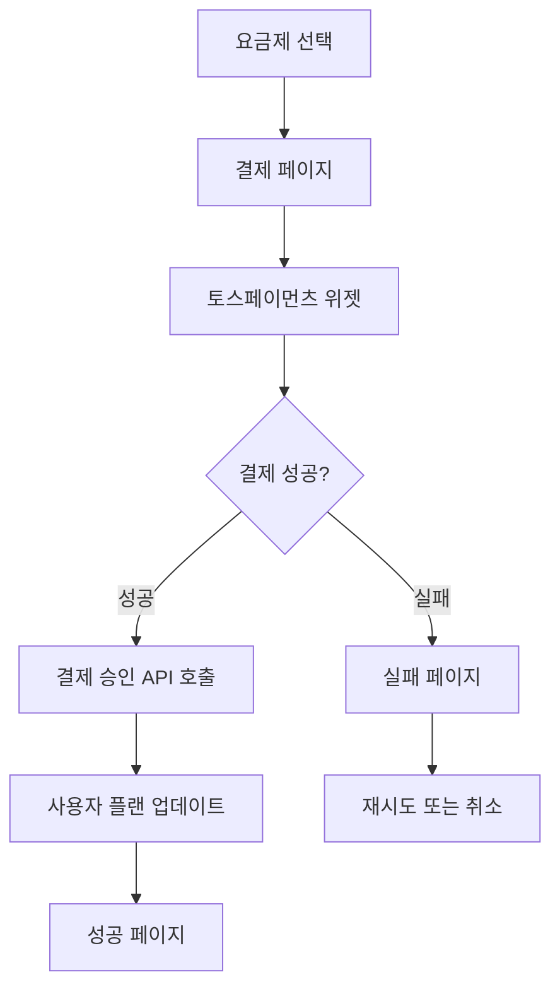

# 토스페이먼츠 결제 시스템 설정 가이드

## 📋 개요

Shot Form AI 서비스에 토스페이먼츠 결제 시스템이 통합되었습니다. 이 문서는 결제 시스템 설정 및 운영 방법을 안내합니다.

## 🔑 필요한 환경 변수

`.env.local` 파일에 다음 환경 변수를 추가하세요:

```bash
# 토스페이먼츠 API 키
NEXT_PUBLIC_TOSS_CLIENT_KEY=test_ck_your_test_client_key
TOSS_SECRET_KEY=test_sk_your_test_secret_key

# 결제 리다이렉트 URL
NEXT_PUBLIC_SUCCESS_URL=http://localhost:3000/checkout/success
NEXT_PUBLIC_FAIL_URL=http://localhost:3000/checkout/fail

# 사업자 정보
NEXT_PUBLIC_BUSINESS_NAME=제이앤유통
NEXT_PUBLIC_BUSINESS_NUMBER=505-16-12345
NEXT_PUBLIC_CEO_NAME=신자동
NEXT_PUBLIC_BUSINESS_ADDRESS=서울특별시 강남구 테헤란로 123, 456호

# 고객센터
NEXT_PUBLIC_SUPPORT_EMAIL=support@shotformai.com
NEXT_PUBLIC_SUPPORT_PHONE=02-1234-5678
```

## 🏗️ 추가된 페이지 및 기능

### 1. 요금제 페이지 (`/pricing`)
- 무료, 프로, 프리미엄 플랜 비교
- 각 플랜별 기능 및 가격 표시
- 결제 페이지로 연결

### 2. 결제 페이지 (`/checkout`)
- 토스페이먼츠 위젯 통합
- 플랜 정보 및 가격 표시
- 이용약관, 개인정보처리방침 동의

### 3. 결제 성공/실패 페이지
- `/checkout/success`: 결제 성공 처리
- `/checkout/fail`: 결제 실패 처리

### 4. 필수 정책 페이지
- `/terms`: 이용약관
- `/privacy`: 개인정보처리방침
- `/refund`: 환불정책

### 5. API 엔드포인트
- `/api/payments/confirm`: 결제 승인 처리

## 🔄 결제 플로우



## 📋 요금제 정보

### 무료 플랜
- 가격: ₩0/월
- 영상 생성: 월 3개
- 기본 기능만 제공

### 프로 플랜
- 가격: ₩29,000/월
- 영상 생성: 월 50개
- TypeCast 프리미엄 음성
- 1080p 고화질 출력
- 고급 자막 애니메이션

### 프리미엄 플랜
- 가격: ₩59,000/월
- 영상 생성: 무제한
- 4K 해상도 지원
- API 액세스
- 24/7 프리미엄 지원

## 🔧 토스페이먼츠 설정

### 1. 개발/테스트 환경
```javascript
const clientKey = "test_ck_zXLkKEypNArWmo50nX3lmeaxYG5R"
const secretKey = "test_sk_zXLkKEypNArWmo50nX3lmeaxYG5R"
```

### 2. 운영 환경
- 토스페이먼츠 가맹점 신청 완료 후 실제 키 발급 필요
- 사업자등록증, 통장사본 등 서류 제출 필요

## 🛡️ 보안 고려사항

### 클라이언트 키 (공개 가능)
- `NEXT_PUBLIC_TOSS_CLIENT_KEY`: 브라우저에서 사용
- 결제 위젯 초기화에 사용

### 시크릿 키 (비공개)
- `TOSS_SECRET_KEY`: 서버에서만 사용
- 결제 승인 API 호출 시 사용
- 절대 클라이언트에 노출되면 안됨

## 📊 데이터베이스 스키마 (추가 필요)

Supabase에 다음 테이블들을 추가해야 합니다:

### payments 테이블
```sql
CREATE TABLE payments (
  id UUID DEFAULT gen_random_uuid() PRIMARY KEY,
  user_id UUID REFERENCES auth.users(id),
  payment_key TEXT NOT NULL,
  order_id TEXT NOT NULL,
  amount INTEGER NOT NULL,
  status TEXT NOT NULL,
  payment_method TEXT,
  card_info JSONB,
  approved_at TIMESTAMP,
  created_at TIMESTAMP DEFAULT NOW(),
  updated_at TIMESTAMP DEFAULT NOW()
);
```

### user_subscriptions 테이블
```sql
CREATE TABLE user_subscriptions (
  id UUID DEFAULT gen_random_uuid() PRIMARY KEY,
  user_id UUID REFERENCES auth.users(id) UNIQUE,
  subscription_tier TEXT DEFAULT 'free',
  usage_count INTEGER DEFAULT 0,
  usage_limit INTEGER DEFAULT 3,
  subscription_start_date TIMESTAMP,
  subscription_end_date TIMESTAMP,
  auto_renewal BOOLEAN DEFAULT false,
  created_at TIMESTAMP DEFAULT NOW(),
  updated_at TIMESTAMP DEFAULT NOW()
);
```

## 🚀 배포 체크리스트

### 개발 완료 후 확인사항
- [ ] 토스페이먼츠 가맹점 신청 완료
- [ ] 실제 API 키로 환경변수 업데이트
- [ ] 결제 테스트 완료
- [ ] 환불 프로세스 테스트
- [ ] 이용약관/개인정보처리방침 법무 검토
- [ ] 사업자등록증 업로드
- [ ] 고객센터 연락처 확인

### 운영 환경 설정
- [ ] HTTPS 설정 완료
- [ ] 도메인 설정 완료
- [ ] 리다이렉트 URL 업데이트
- [ ] 에러 모니터링 설정
- [ ] 로그 수집 설정

## 📞 지원 및 문의

### 토스페이먼츠 관련
- 개발자 문서: https://docs.tosspayments.com/
- 고객센터: 1644-8051

### 프로젝트 관련
- 개발자: 신자동
- 이메일: support@shotformai.com
- 전화: 02-1234-5678

## 🔄 업데이트 이력

- 2024.12.25: 초기 결제 시스템 구축 완료
- 토스페이먼츠 연동 완료
- 요금제 페이지 및 결제 플로우 구현
- 필수 정책 페이지 작성 